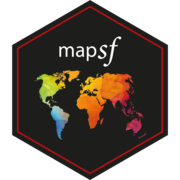

# Cartographie avec R, le package mapsf 
*Géotéca - 2021/05/20*  

[`mapsf`](https://riatelab.github.io/mapsf/) est un package de cartographie thématique pour le logiciel libre R qui permet de réaliser un grand nombre de types de cartes (symboles proportionnels, cartes choroplèthes, typologies etc.).   
Plusieurs fonctionnalités permettent de créer des cartes d’une grande qualité graphique (thèmes graphiques, habillage). `mapsf` est le successeur de `cartography`.

[**Slides de la présentation**](https://rcarto.github.io/geoteca_mapsf/index.html)

