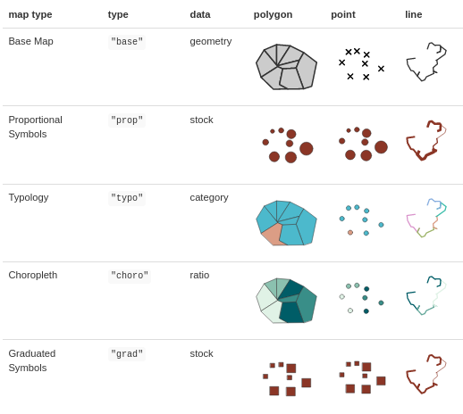
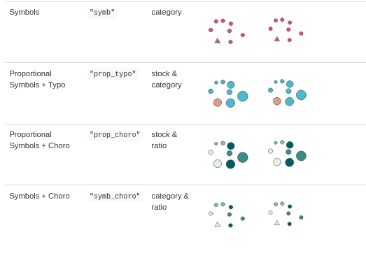
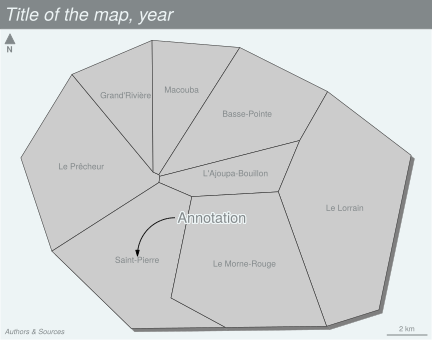

# [L'écosystème spatial de R](https://frama.link/rspatial2019)


# Le package `mapsf`


## Créer une carte

La fonction `mf_map()` est la fonction principale du package :  


```r 
mf_map(x = objet_sf, 
       var = "variable", 
       type = "type de carte", 
       ...)
```


## `mf_map()` {data-background=img/help.png data-background-size=contain}


## Les types de cartes

<div class="columns-2">
  
  
  
</div>


## La mise en page
<div class="columns-2"> 

  

 
 

```r
mf_title()
mf_arrow()
mf_credits()
mf_scale() 	
mf_layout() 
mf_annotation() 	
mf_label()
mf_shadow()
```

</div>


## https://riatelab.github.io/mapsf/

[](https://riatelab.github.io/mapsf/)


## Les vignettes

- [Introduction et exemples](https://riatelab.github.io/mapsf/articles/mapsf.html#examples-of-thematic-maps-1)
- [Export des cartes](https://riatelab.github.io/mapsf/articles/web_only/how_to_export_maps.html)
- [Les cartons ou *insets*](https://riatelab.github.io/mapsf/articles/web_only/how_to_create_inset_maps.html)
- [Les thèmes](https://riatelab.github.io/mapsf/articles/web_only/how_to_use_themes.html)


## Merci


  [riatelab.github.io/mapsf/](https://riatelab.github.io/mapsf/)  
</br>
  [gitlab.huma-num.fr/rCarto/geoteca_mapsf](https://gitlab.huma-num.fr/rCarto/geoteca_mapsf)  
</br>
  [github.com/riatelab/mapsf](https://github.com/riatelab/mapsf)  
</br>
  [\@rgeomatic](http://twitter.com/rgeomatic)  
</br>
  [rgeomatic.hypotheses.org](https://rgeomatic.hypotheses.org/)
